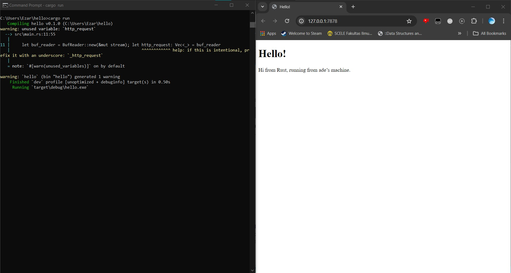

Mochammad Ezar Yudha 2206046746

<h1>Tutorial 6</h3>

<h3>Reflection 1</h3>
handle_connection processes an incoming TCP stream and reads an HTTP request. It uses a BufReader to read the lines from the stream, collects them into a vector, and then prints the HTTP request.

<h3>Reflection 2</h3>

handle_connection first creates a buffered reader to read the lines from the TCP stream. Then, it reads the lines from the stream, unwraps each result, and collects them into a vector (http request). Then, the print statement prints the recieved HTTP request lines. Finally, it creates an HTTP response by formatting the status line, content length, and file contents and write it back to the TCP stream.